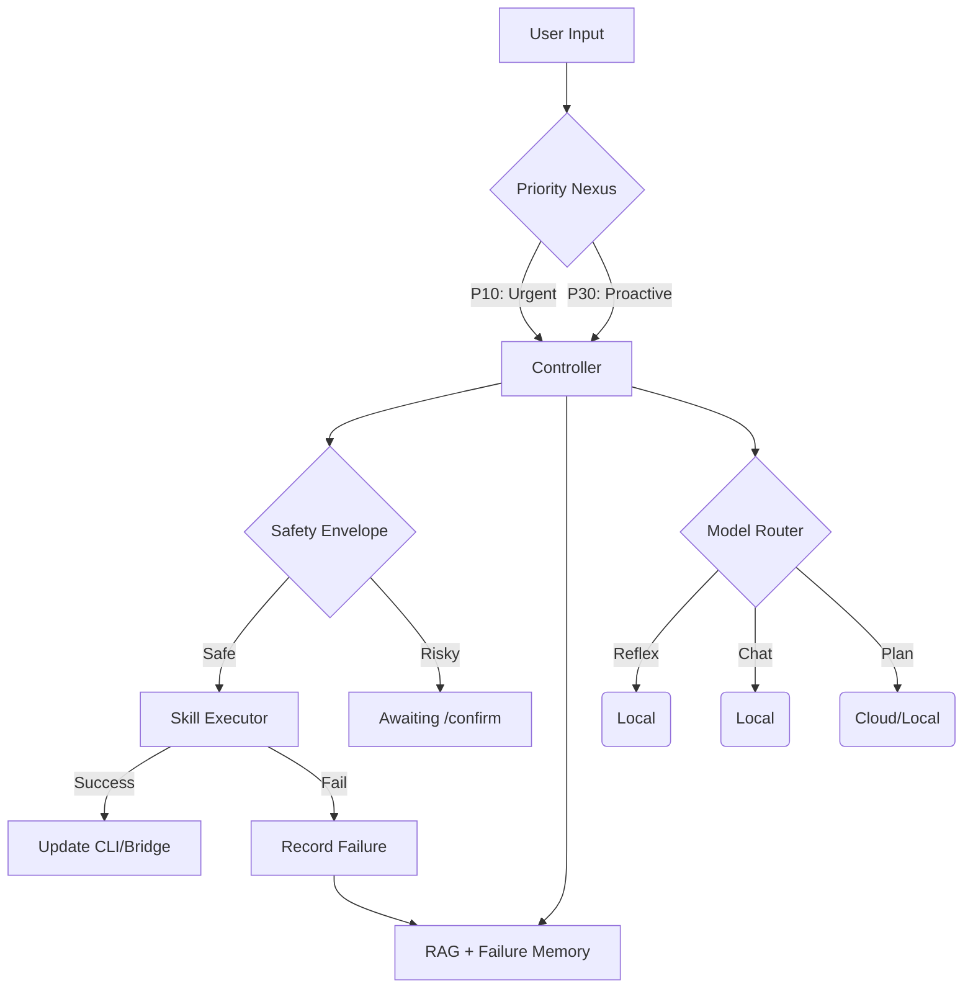

# VIKI Architecture (v7.1.0 Cortex)

## Core Philosophy
Following the **Cortex Upgrade**, VIKI follows a "Professional Intelligence" design pattern:
1.  **Priority-Based Ingress (The One True Event Loop)**: All IO (Terminal, Discord, Telegram, Voice) is funneled into a single `asyncio.PriorityQueue`. Urgent user inputs are prioritized over background proactive suggestions.
2.  **Polymorphic Intelligence**: Cognition is split into three tiers:
    *   **Reflex**: High-speed intent detection (Regex + Phi-3).
    *   **Chatter**: Natural conversational flow (Llama 3).
    *   **Planning**: Multi-step task solving and tool use (DeepSeek R1).
3.  **Autonomous Safety**: All actions pass through a **Safety Envelope** that enforces tiered authorization (Safe/Medium/Destructive).
4.  **Mistake Prevention**: A **Failure Memory** layer records unsuccessful attempts, providing "negative constraints" to prevent repetitive errors.

## Module Breakdown

### 1. The Controller (`viki/core/controller.py`)
*   **Role**: Central Processing Unit.
*   **Function**: Manages the "Think-Action-Learn" loop with integrated **Latency Budgeting** to maintain system responsiveness during high-complexity tasks.

### 2. The Nexus (`viki/api/nexus.py`)
*   **Role**: Priority Dispatcher.
*   **Function**: Aggregates inputs into a single `PriorityQueue`. Implements explicit task cancellation and lifecycle management for background processes.

### 3. Safety Layer (`viki/core/safety.py`)
*   **Role**: Executive Constraint.
*   **Function**: Classifies tool calls based on risk. Intercepts "Medium" and "Destructive" actions for mandatory user confirmation (`/confirm`).

### 4. Learning & Failure Memory (`viki/core/learning.py`)
*   **Role**: Long-Term Stability (SQLite v3).
*   **Function**: Houses both **Semantic Lessons** (facts) and **Failure Logs** in a unified SQLite database. Uses semantic search to retrieve relevant past errors before planning new actions. Replaces legacy JSON-based memory with an optimized relational structure.

## Cognitive Data Flow

