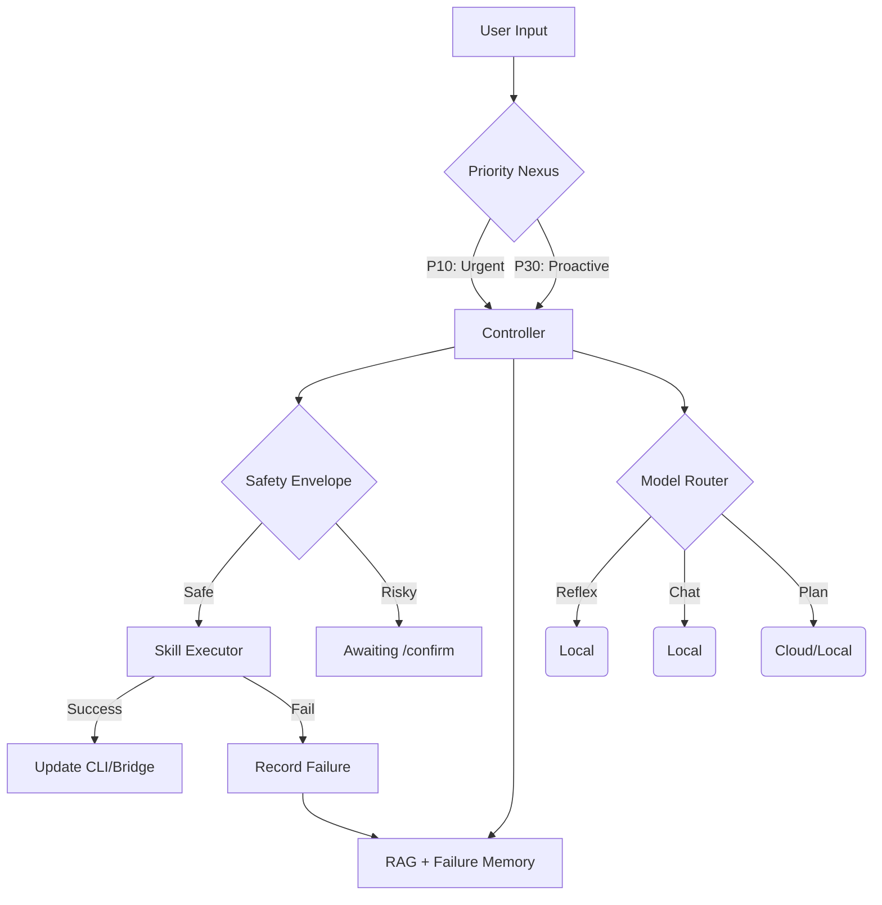

# VIKI Architecture (v8.0.0 Industrial)

## Core Philosophy
Following the **Industrial Restructuring**, VIKI follows a **Clean Architecture (Hexagonal)** and **Domain-Driven Design (DDD)** pattern:
1.  **Dependency Injection (Inversion of Control)**: All core services and use cases are managed by a central `Container` (`viki/container.py`). This decouples object creation from business logic.
2.  **Layered Separation of Concerns**:
    *   **Domain**: Pure business logic, entities, and repository interfaces. No external dependencies.
    *   **Application**: Orchestrates use cases and application services (e.g., `SafetyService`).
    *   **Infrastructure**: Concrete implementations of domain interfaces (e.g., `SqlAlchemyLearningRepository`).
    *   **Presentation**: External interfaces (CLI, REST API, Event Bus).
3.  **Repository Pattern**: Data access is abstracted through interfaces, allowing seamless swapping of persistence layers (SQLite, PostgreSQL, etc.).
4.  **Autonomous Safety**: Safety logic is encapsulated in an application service and injected into the execution pipeline, ensuring consistent policy enforcement.
5.  **Polymorphic Intelligence**: Cognition remains tiered (Reflex, Chatter, Planning), but orchestrated through clean use-case boundaries.

## Module Breakdown

### 1. The Controller (`viki/core/controller.py`)
*   **Role**: Central Processing Unit.
*   **Function**: Manages the "Think-Action-Learn" loop with integrated **Latency Budgeting** to maintain system responsiveness during high-complexity tasks.

### 1. The Container (`viki/container.py`)
*   **Role**: Composition Root.
*   **Function**: Manages the lifecycle and wiring of all application components. Uses `dependency-injector` to provide singleton services to the controller and presentation layers.

### 2. The Controller (`viki/core/controller.py`)
*   **Role**: Application Coordinator.
*   **Function**: Acts as the primary entry point for the "Think-Action-Learn" loop. Dependencies (Safety, Memory Recall, Model Router) are injected from the Container.

### 3. Application Services (`viki/application/`)
*   **Safety Service**: Encapsulates the safety envelope and action validation.
*   **Memory Recall Use Case**: Orchestrates semantic retrieval from the learning repository.

### 4. Infrastructure Adapters (`viki/infrastructure/`)
*   **Learning Repository**: SQLAlchemy-based implementation for managing lessons and failures in SQLite.
*   **MCP Client**: Integration with external MCP servers.

### 5. Model Enhancement & Observability
*   **Knowledge Gaps** (`viki/core/knowledge_gaps.py`): Records low-confidence responses; dream research uses `get_research_topics()`.
*   **Pattern Tracker**: Persists patterns to disk; survives restarts.
*   **Performance API**: `GET /api/models/performance` (trust score, latency, error rate per model).
*   **Continuous Learner** (`viki/core/continuous_learning.py`): Optional periodic training cycles with validation.

See [viki/skills/creation/forge.py](viki/skills/creation/forge.py) (Neural Forge: prompt-bake writes `data/Modelfile.viki_evolved`, then `ollama create` with default tag **`viki-neural-forge`**, overridable via `system.forge_output_ollama_tag` / `VIKI_FORGE_OUTPUT_OLLAMA_MODEL`; optional LoRA) and [viki/SECURITY_SETUP.md](viki/SECURITY_SETUP.md) for operational details. CLI entry: [scripts/build_viki_model.py](scripts/build_viki_model.py).

## Cognitive Data Flow

```mermaid
graph TD
    User[User Input] --> Nexus{Priority Nexus}
    Nexus -->|P10: Urgent| Controller
    Nexus -->|P30: Proactive| Controller
    
    Controller --> SafetyCheck{Safety Envelope}
    SafetyCheck -->|Safe| Executor[Skill Executor]
    SafetyCheck -->|Risky| Confirm[Awaiting /confirm]
    
    Controller --> Memory[RAG + Failure Memory]
    Controller --> Router{Model Router}
    
    Router -->|Reflex| Phi3(Local)
    Router -->|Chat| Llama3(Local)
    Router -->|Plan| DeepSeek(Cloud/Local)
    
    Executor -->|Success| UI[Update CLI/Bridge]
    Executor -->|Fail| Record[Record Failure]
    Record --> Memory
```

## Frontier Wiring (2026 Gap-Closure)

The original "5-Layer Consciousness Stack" claims now match implementation. Each
of the items below was wired up during the internal **frontier / gap-closure** effort
and is exercised by tests under `viki/tests/`:

- **MCP integration is live.** [`viki/integrations/mcp_client.py`](viki/integrations/mcp_client.py) is loaded at controller boot via `attach_mcp_skills_sync` (called from `VIKIController.__init__` and `viki/main.py`). External tools listed in [`viki/config/mcp_servers.yaml`](viki/config/mcp_servers.yaml) appear as native skills, and `/api/mcp/servers` enumerates them.
- **Promotion gate fixed.** `ContinuousLearner._capability_index_for` now constructs `CapabilityIndex(results_root, min_tasks, bootstrap_iters)` using positional/typed args. P0 regression test: [`viki/tests/test_forge_promotion.py`](viki/tests/test_forge_promotion.py).
- **Real SSE chat streaming.** `/api/chat/stream` runs `controller.process_request` in a worker thread and drains a `queue.Queue` per event; `ui/src/App.jsx` consumes it via a `fetch` ReadableStream with a stop button.
- **LSP bridge is functional.** `hover`, `references`, `definition`, and `publishDiagnostics` are implemented in [`viki/integrations/lsp_bridge.py`](viki/integrations/lsp_bridge.py) with tests in [`viki/tests/test_lsp_bridge.py`](viki/tests/test_lsp_bridge.py).
- **Computer-use grounding is real.** No more dummy full-screen bbox; low-confidence detections are rejected, and an OmniParser-V2 ONNX adapter is loaded when `VIKI_OMNIPARSER_ONNX` points at a model file.
- **Vector memory lexical fallback ranks.** `_LexicalFallbackBackend.search` now does Jaccard token-overlap scoring (`viki/core/vector_memory.py`).
- **Capability Index hardening (P2).** Min-task threshold, 95% bootstrap CI per suite, and SHA256 provenance hashes are computed in [`viki/core/capability_index.py`](viki/core/capability_index.py); configured via `forge.capability_index_min_tasks` and `forge.capability_index_bootstrap_iters` in `settings.yaml`.
- **Real benchmark adapters.** [`scripts/evals/datasets.py`](scripts/evals/datasets.py) provides downloadable adapters for SWE-bench Verified, HumanEval+, LiveCodeBench, GAIA, AgentBench, BigCodeBench, GPQA Diamond.
- **Persistent code-search index + watcher.** [`viki/skills/builtins/code_search_skill.py`](viki/skills/builtins/code_search_skill.py) writes to `data/code_index.db`; [`viki/skills/builtins/code_index_watcher.py`](viki/skills/builtins/code_index_watcher.py) re-indexes via `watchdog` when files change.
- **Best-of-N worktrees.** [`viki/core/worktree_runner.py`](viki/core/worktree_runner.py) runs parallel `PlanEditSkill` attempts in isolated `git worktree`s.
- **Mission control CRUD.** API: `POST /api/missions`, `POST /api/missions/<id>/cancel`, `GET /api/missions/<id>/graph`, `GET /api/subagents`, `POST /api/subagents/<id>/cancel`, plus a node-graph + sub-agent panel in `ui/src/Dashboard.jsx`.
- **WebSocket bidirectional channel.** `flask-sock` handler at `/ws` streams unified events from the in-process `EventBus` ([`viki/api/events.py`](viki/api/events.py)) and accepts cancel/interrupt commands.
- **Sandboxed code execution.** [`viki/core/sandbox.py`](viki/core/sandbox.py) provides a Docker backend (with subprocess fallback) used by the python-interpreter and shell skills.
- **Forge operator controls.** `POST /api/forge/promote` and `POST /api/forge/rollback` (admin-secret guarded) plus dashboard buttons in `Dashboard.jsx`.
- **Tracing is persistent + Gantt visualized.** [`viki/core/tracing.py`](viki/core/tracing.py) propagates `trace_id`/`parent_span_id` via `contextvars` and persists to `data/traces.db`; `/api/traces/grouped` feeds the Gantt panel.
- **Artifact manifest endpoint.** `GET /api/artifacts/<mission_id>` returns the manifest; `GET /api/artifacts/<mission_id>/file?path=...` streams artifact files with path-traversal guards.
- **Multi-modal attachments.** `_AttachmentStage` in [`viki/core/request_pipeline.py`](viki/core/request_pipeline.py) routes images through a `vision` skill, audio through `whisper`, and inlines text attachments.
- **`history.undo_last()` is implemented.** Used by the new `/undo` slash command.
- **Per-model scorecard sparklines + regression detection (P2).** `IntelligenceScorecard.get_segmented_trends()` powers the `/api/scorecard/trends` endpoint and the dashboard sparkline UI.
- **Bio sensing is honest about scope (P2).** `BioModule(backend="stub")` is the default and is tagged `experimental=True`. Set `system.bio_backend: deepface` (or `VIKI_BIO_BACKEND=deepface`) to opt into the real DeepFace path.
- **Dynamic skills (P2).** SQL skill supports SQLite/Postgres/MySQL with `limit`+`offset` pagination and `next_offset`; AWS skill uses boto3 paginators with `page_size`/`max_pages`; kubectl skill supports streamed `--follow` logs with bounded buffers.
- **Tier-1 integration tests.** Boot smoke ([`viki/tests/test_controller_boot.py`](viki/tests/test_controller_boot.py)), MCP ([`viki/tests/test_mcp_integration.py`](viki/tests/test_mcp_integration.py)), continuous learning ([`viki/tests/test_continuous_learning_integration.py`](viki/tests/test_continuous_learning_integration.py)), Cortex layers ([`viki/tests/test_cortex_layers.py`](viki/tests/test_cortex_layers.py)), and existing LSP bridge tests pin the wiring.

## Low-resource mode (low-end PC optimization)

VIKI ships with two coordinated low-resource paths so the agent stays usable on 4 GB / 4-core machines:

- **Lazy heavy skills.** `viki/skills/lazy_skill.py` defines `LazySkillProxy`, registered in place of every skill that imports an optional heavy dep (`torch`, `playwright`, `pandas`, `pdfplumber`, `whisper`, `onnxruntime`, …). The proxy advertises stable metadata (name, description, schema, safety tier) so the planner can list the skill without paying the import cost. The real class is constructed inside an `asyncio.Lock`-guarded loader on first `execute(...)`. Failed imports are sticky: subsequent calls return a typed "unavailable" error instead of retrying.
- **`system.low_resource_mode` flag.** When true (or `VIKI_LOW_RESOURCE=1`), `_register_default_skills` logs the mode and the controller skips the autonomous startup pulse, wellness pulse, dream monitor, reflector, watchdog, and the continuous-learning loop. Settings-driven cadences (`proactive.wellness_interval_s`, `forge.continuous_learning_*_s`) let operators dial down the remaining heartbeats further.
- **Bounded `PatternTracker`.** `viki/core/cortex.py` caps in-memory entries at `VIKI_PATTERN_TRACKER_MAX` (default 5000) with LRU eviction by `last_seen`, and debounces JSON dumps every `VIKI_PATTERN_TRACKER_SAVE_EVERY` writes (default 10) to keep cheap SSDs / spinning disks happy.
- **UI lite mode.** `ui/src/HologramFace.jsx` dynamically imports `@react-three/fiber`, `@react-three/drei`, and `HologramGirl3D` so they aren't part of the initial bundle, and renders a CSS-only orb when `?lite=1`, `localStorage.viki_lite === '1'`, or `navigator.hardwareConcurrency <= 4` / `navigator.deviceMemory <= 4`.

Tests pin both paths: [`viki/tests/test_lazy_skill_proxy.py`](viki/tests/test_lazy_skill_proxy.py) verifies metadata-without-load, deferred import, and failure isolation. [`viki/tests/test_low_resource_mode.py`](viki/tests/test_low_resource_mode.py) boots a real controller with `VIKI_LOW_RESOURCE=1` and asserts that `viki.skills.builtins.{vision,browser,computer_use,whisper,pdf,…}_skill` modules are *not* in `sys.modules` after construction.

## Monorepo siblings (not imported by `viki/`)

These directories ship in the same repository but are **optional** sidecars:

| Path | Role |
|------|------|
| [`ui/`](ui/) | Operator dashboard: chat (SSE), hologram, missions, forge controls |
| [`security-lab/`](security-lab/) | Standalone FastAPI lab: prompt-injection heuristics, RBAC tools, audit DB |
| [`qa-automation/`](qa-automation/) | Learning-oriented API/UI/perf test examples and CI samples |

They do not change runtime imports for `python viki/main.py`; see each folder’s README for setup.
