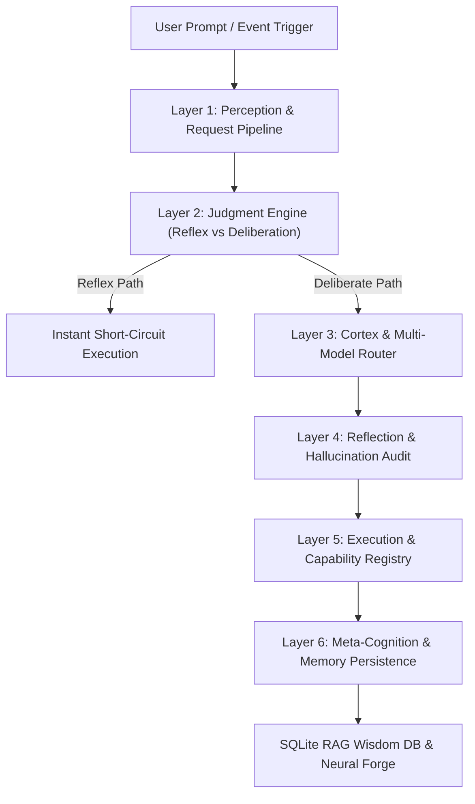

> **Supreme Architect of The Code Eternal. An advanced autonomous AI agent system with cognitive architecture (Orythix), local multi-model routing, self-healing incident response, and high-performance terminal interface.**

<div align="center">

# VIKI: Sovereign Autonomous AI Agent & Local LLM Engineer

**Local LLM Orchestration • Air-Gapped Privacy • Autonomous Self-Evolution • Full-SDLC Engineering Swarm**

[](https://github.com/Orythix/viki)
[](https://mypy-lang.org)
[](https://docs.astral.sh/ruff)
[](https://www.python.org/downloads/)
[](https://lmstudio.ai)
[](https://github.com/Orythix/viki)
[](./LICENSE)
[](./docs/DOCKER.md)

---

[Key Features](#key-features) • [Chinese Overview / 中文说明](#chinese-overview--中文说明) • [Multi-Model Provider Matrix](#multi-model-provider-matrix) • [Architecture](#technical-architecture) • [Quick Start](#quick-start) • [Engineering Playbooks](#engineering-playbooks--sdlc) • [Neural Forge](#build-your-viki-model-neural-forge) • [FAQ](#frequently-asked-questions) • [License](#license)

</div>

---

## What is VIKI? (Project Overview)

**VIKI** (**Virtual Intelligence Knowledge Interface**) is a production-grade, **self-hosted autonomous AI agent** and **developer-first AI engineer** written in Python. Built for **local-first privacy** and **zero data leakage**, VIKI runs natively on your hardware via **LM Studio** and **Ollama**, while seamlessly supporting cloud frontier models (**OpenAI GPT-4o**, **Anthropic Claude 3.7 Sonnet**, **Google Gemini 2.5 Pro**).

Powered by the **Orythix Cognitive Architecture**, VIKI provides deep ReAct reasoning, multi-agent swarm orchestration, automated incident healing (Sentry/Datadog stack trace ingestion), persistent SQLite RAG memory, and self-evolution through the **Neural Forge**—all accessible via an ultra-fast **CLI-first** REPL and web dashboard.

---

## Chinese Overview / 中文说明

**VIKI**（虚拟智能知识接口）是一个高性自托管自主 AI 智能体与开发者优先的 AI 工程师系统。VIKI 专为**本地优先与隐私安全**设计，能够在无数据泄漏的前提下在本地硬件上运行（基于 **LM Studio** 和 **Ollama**），同时也无缝支持云端顶级大模型（**OpenAI GPT-4o**、**Anthropic Claude 3.7 Sonnet**、**Google Gemini 2.5 Pro**）。

### 核心优势 (Key Highlights in Chinese):
- **100% 本地与物理隔离**: 默认操作无需依赖外网 API（开启 `VIKI_AIR_GAP=1` 模式），保障核心代码与数据安全。
- **Orythix 认知架构**: 具备五层认知大脑（感知、判断、思考、反思、执行与元认知），在执行前自动审计计划，有效降低幻觉。
- **多模型灵活路由**: 自动分发任务至本地模型（LM Studio/Ollama）或云端模型（OpenAI/Claude/Gemini）。
- **全生命周期软件工程与 Jira 自动化**: 自动解析 Jira 需求、生成技术规范、编写 TDD 测试套件、执行 AST 代码重构以及生成 OpenAPI/gRPC 接口。
- **自主故障修复**: 支持对接 Sentry/Datadog 告警，在隔离的 Git Worktree 中重现 Bug 并自动修复。
- **神经铸造厂 (Neural Forge)**: 无需 GPU 训练，将交互经验与 SQLite 记忆直接“烘焙”到本地模型的 System Prompt 中。

---

## Key Features

- **100% Sovereign & Air-Gap Capable**: Default operation never leaves your local network (`VIKI_AIR_GAP=1`). Zero telemetry, zero external tracking.
- **Orythix 5-Layer Cognitive Cortex**: Judgment, Deliberation, Reflection, Execution, and Meta-Cognition layers reduce hallucinations and audit plans before execution.
- **Multi-Model Provider Routing**: Instantly switch or auto-route between **LM Studio**, **Ollama**, **OpenAI**, **Anthropic Claude**, and **Google Gemini**.
- **Full-SDLC & Jira Automation**: Automated Jira ticket parsing, technical spec generation, TDD test suites, AST codemods, and OpenAPI 3.1 / gRPC proto generation.
- **Autonomous Incident Healing**: Connects to Sentry/Datadog webhooks, reproduces bugs in isolated Git worktrees, applies targeted fixes, verifies via pytest, and creates PRs.
- **Multi-Agent Swarm Engineering**: Execute complex DAG tasks using leader-worker agent swarms and Monte Carlo Tree Search (MCTS) reasoning.
- **Local Neural Forge**: Bakes user feedback and lessons accumulated in SQLite directly into custom model system prompts without GPU training.
- **Low-Hardware Optimization**: Runs efficiently on **8 GB RAM** laptops (with dedicated 4k token caps, prompt compression, and LRU entity extraction caching).
- **Capability Gating & Security**: Sandboxed file and shell execution (`viki/core/sandbox.py`) with strict permission boundaries and prompt injection detection.

---

## Multi-Model Provider Matrix

VIKI dynamically routes queries to the optimal provider profile configured in [`config/models.yaml`](config/models.yaml):

| Provider | Supported Models / Endpoints | Privacy / Mode | Best For |
| :--- | :--- | :--- | :--- |
| **LM Studio** | `gemma-4-e4b`, `qwen3.5-9b`, `deepseek-r1` (`http://localhost:1234/v1`) | **100% Local / Air-Gapped** | Default offline coding & privacy |
| **Ollama** | `llama3`, `codellama`, `mistral`, `phi3` (`http://localhost:11434/v1`) | **100% Local / Air-Gapped** | Local CLI automation & zero-cost tasks |
| **OpenAI** | `gpt-4o`, `gpt-4o-mini`, `o3-mini` | Cloud API | Deep architectural reasoning & code review |
| **Anthropic** | `claude-3-7-sonnet`, `claude-3-5-haiku` | Cloud API | Full-SDLC engineering & complex refactoring |
| **Google** | `gemini-2-5-pro`, `gemini-2-5-flash` | Cloud API | Multimodal vision & massive context research |

---

## Technical Architecture

VIKI executes tasks through a deterministic **5-Layer Consciousness Cortex**:



---

## Quick Start

### Prerequisites
- **Python 3.10+** (3.10, 3.11, and 3.12 supported)
- **Local Inference Server**: [LM Studio](https://lmstudio.ai) or [Ollama](https://ollama.ai) running locally (`http://localhost:1234` or `http://localhost:11434`)

### 1. Installation

```bash
# Clone repository
git clone https://github.com/Orythix/viki.git
cd viki

# Create & activate virtual environment
python -m venv .venv
# On Windows (PowerShell):
./.venv/Scripts/Activate.ps1
# On Linux/macOS:
source .venv/bin/activate

# Install core package
pip install -e .
```

### 2. Configure Environment

```bash
cp .env.example .env
```
*(Optionally set `OPENAI_API_KEY`, `ANTHROPIC_API_KEY`, `GEMINI_API_KEY`, or custom `VIKI_PERSONA` in `.env`)*

### 3. Launch VIKI

```bash
# Start interactive CLI REPL in current workspace
viki

# Single-shot command (runs task and exits)
viki "refactor auth logic in src/viki/core/security.py"

# Run with Dev Persona (coding-focused skills)
VIKI_PERSONA=dev viki
```

---

## Docker Deployment

Run VIKI in an isolated container using Docker Compose:

```bash
# Build and run interactive container
docker compose build
docker compose run --rm -it viki
```

*See [docs/DOCKER.md](docs/DOCKER.md) for advanced container configurations.*

---

## Engineering Playbooks & SDLC

VIKI includes **40+ built-in engineering playbooks** spanning the complete software development lifecycle:

- **Define & Plan**: `idea_refine`, `spec_driven_development`, `planning_and_task_breakdown`, `jira_sdlc_workflow`
- **Build & Refactor**: `incremental_implementation`, `test_driven_development`, `ast_codemod`, `openapi_schema`, `frontend_ui_engineering`
- **Verify & Review**: `browser_testing_with_devtools`, `debugging_and_error_recovery`, `code_review_and_quality`, `security_and_hardening`
- **Ship & Recover**: `git_workflow_and_versioning`, `ci_cd_and_automation`, `autonomous_incident_healing`

---

## Build Your VIKI Model (Neural Forge)

Bake your accumulated SQLite lessons and project wisdom directly into custom LM Studio model profiles without GPU training:

```bash
# Bake top lessons into data/Modelfile.viki_evolved
python scripts/build_viki_model.py

# Set models.yaml default profile to lmstudio-gemma4e4b
python scripts/build_viki_model.py --set-default
```

---

## Comparison: VIKI vs Other AI Agents

| Feature | VIKI | AutoGPT | LangChain | Manus / Devin |
| :--- | :---: | :---: | :---: | :---: |
| **Air-Gapped Privacy** | Yes (100% Local) | No (Cloud API) | Limited (Library only) | No (Cloud Hosted) |
| **Local LLM Native** | Yes (LM Studio / Ollama) | Limited | Requires custom code | No (Cloud Hosted) |
| **Incident Healing (Sentry)** | Yes (Built-in) | No | No | Proprietary |
| **Neural Forge Evolution** | Yes (Built-in) | No | No | No |
| **MCTS Swarm Execution** | Yes (Built-in) | No | Manual DAG required | Proprietary |
| **Open Source License** | Yes (Apache-2.0) | Yes (MIT) | Yes (MIT) | Closed Source |

---

## Frequently Asked Questions

<details>
<summary><b>Is VIKI completely free and open source?</b></summary>
Yes. VIKI is released under the Apache-2.0 open source license. You can self-host, modify, and deploy VIKI freely without any required cloud subscription.
</details>

<details>
<summary><b>Does VIKI support cloud AI models like Claude or GPT-4o?</b></summary>
Yes. VIKI features a unified provider adapter supporting LM Studio, Ollama, OpenAI (GPT-4o), Anthropic (Claude 3.7 Sonnet), and Google Gemini (2.5 Pro). Configure your API keys in .env or config/models.yaml.
</details>

<details>
<summary><b>Can VIKI run on laptops with 8 GB RAM?</b></summary>
Yes. VIKI is specifically optimized for low-spec hardware (4 GB / 8 GB RAM) with aggressive token capping, prompt compression, LRU entity extraction caching, and lazy skill loading.
</details>

---

## Documentation Index

- [Full Documentation Sitemap](docs/DOCUMENTATION.md)
- [Installation & Setup Guide](docs/SETUP.md)
- [VIKI Runbook & Troubleshooting](docs/VIKI_RUNBOOK.md)
- [Docker Deployment Guide](docs/DOCKER.md)
- [System Architecture & Data Flow](docs/ARCHITECTURE.md)
- [Security Policy & Capability Gating](docs/SECURITY.md)

---

## Keywords & Topics

`Local AI Agent` • `Autonomous AI Engineer` • `Self-Hosted AI Assistant` • `LM Studio Agent` • `Ollama Agent` • `Air-Gapped AI` • `Sovereign AI` • `ReAct Reasoning` • `Model Context Protocol (MCP)` • `Agentic SDLC` • `Sentry Bug Healing` • `Neural Forge` • `Private LLM` • `Python AI Agent` • `中文 AI 智能体` • `本地大模型`

---

## License

VIKI is licensed under the [Apache License 2.0](./LICENSE).
